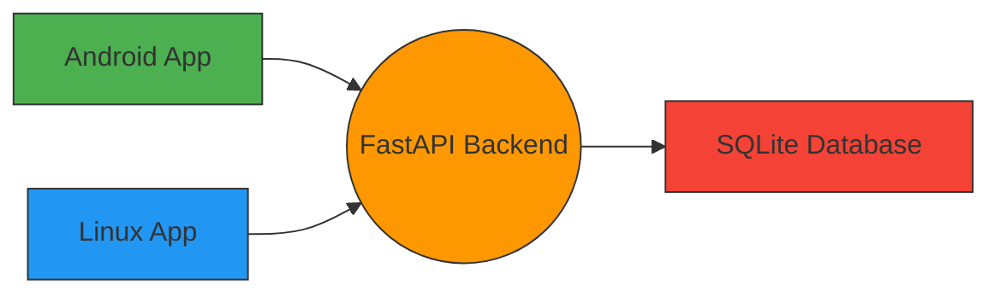

# Todo Sync App

## Über dieses Projekt

Todo Sync ist eine cross-platform TODO-Anwendung für Android und Linux (Manjaro), die über ein Heimnetzwerk mit einem Raspberry Pi Backend synchronisiert. Die Anwendung implementiert einen Last Write Wins (LWW) Strategie zur Konfliktlösung und zeigt Konflikt-Logs in beiden GUIs an.

## Architektur



## Phase 2: Backend Implementierung

In dieser Phase wurde das Backend der Todo Sync Anwendung implementiert, inklusive:

- Vollständige REST API mit LWW Strategie
- WebSocket Synchronisation
- SQLite Datenbank im WAL Modus
- Konfliktbehandlung und Logging
- systemd Service für Raspberry Pi
- Smoke Test Skript

### Backend Features

#### REST Endpoints
- `GET /api/v1/todos` - Liste aller Todos
- `POST /api/v1/todos` - Neues Todo anlegen
- `PUT /api/v1/todos/{id}` - Todo aktualisieren (mit LWW)
- `DELETE /api/v1/todos/{id}` - Todo löschen
- `GET /api/v1/conflict-logs` - Konfliktprotokoll auflisten

#### WebSocket Synchronisation
- `/ws/sync` - Synchronisationskanal für Änderungen

#### Datenbank
- SQLite mit WAL Modus für bessere Leistung
- Tabellen für Todos und Konflikte

#### Konfliktlösung (Last Write Wins)
- Bei Konflikten gewinnt der Eintrag mit dem neueren `updated_at` Timestamp
- Alle Konflikte werden in die Konfliktprotokolltabelle geloggt

## Technologien
    
- **Backend**: FastAPI (Python 3.11+)
- **Frontend**: Svelte 5 + TypeScript (Vite) mit Tauri 2.0
- **Datenbank**: SQLite mit WAL Mode
- **Synchronisation**: REST API + WebSocket
- **Deployment**: systemd auf Raspberry Pi

## Setup

### Lokale Entwicklung

1. `pip install -r requirements.txt`
2. `fastapi run backend/main.py --host 0.0.0.0 --port 8000`

### Raspberry Pi Deployment

1. Installiere Python 3.11+
2. Erstelle einen virtuellen Environment: `python -m venv venv`
3. Aktiviere den Environment: `source venv/bin/activate`
4. Installiere Abhängigkeiten: `pip install -r requirements.txt`
5. Platziere die `todo-api.service` Datei in `/etc/systemd/system/`
6. Starte den Service: `sudo systemctl start todo-api.service`
7. Aktiviere Autostart: `sudo systemctl enable todo-api.service`

## API Dokumentation

Die vollständige API Dokumentation ist im Swagger UI unter `/docs` verfügbar.

## Konfliktbehandlung

Bei Konflikten wird die Last Write Wins Strategie verwendet:
1. Die Änderung mit dem neueren `updated_at` Timestamp gewinnt 
2. Beide Versionen werden im Konfliktprotokoll geloggt
3. Die anderen GUIs zeigen diese Konflikte in ihren Logs an

## Testen

Führe die Smoke Tests aus:
```bash
python smoke_test.py
```
