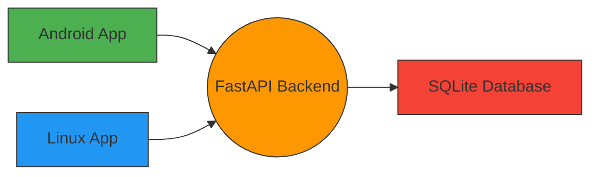

# Todo Sync App

## Über dieses Projekt

Todo Sync ist eine cross-platform TODO-Anwendung für Android und Linux (Manjaro), die über ein Heimnetzwerk mit einem Raspberry Pi Backend synchronisiert. Die Anwendung implementiert einen Last Write Wins (LWW) Strategie zur Konfliktlösung und zeigt Konflikt-Logs in beiden GUIs an.

## Architektur



## Funktionen

- Cross-platform TODO-Verwaltung (Android + Linux)
- Synchronisation über Heimnetzwerk (192.168.2.2)
- Last Write Wins Konfliktlösung
- Konflikt-Logs in beiden GUIs
- Einfache Installation und Wartung

## Systemvoraussetzungen

### Backend (Raspberry Pi)
- Raspberry Pi mit Debian/Ubuntu (z.B., Raspbian)
- Python 3.11+
- FastAPI
- SQLite

### Frontend (Android + Linux)
- Android 8.0+ (APK)
- Linux mit AppImage/RPM (Manjaro)

## Setup Anleitung

### Raspberry Pi Backend (Backend Setup)
1. Python 3.11+ installieren
2. Repository clonen oder Dateien hochladen
3. Abhängigkeiten installieren: `pip install -r backend/requirements.txt`
4. FastAPI Server starten: `uvicorn backend.main:app --host 0.0.0.0 --port 8000`

### Android App (Frontend)
1. Tauri App builden und signieren
2. Android-App auf dem Gerät installieren

### Linux App (Frontend)
1. Tauri App builden
2. AppImage oder RPM installieren

## API Übersicht

### REST Endpunkte
- `GET /api/v1/todos` - Alle TODOs abrufen
- `POST /api/v1/todos` - Neue TODO erstellen
- `PUT /api/v1/todos/{id}` - TODO aktualisieren
- `DELETE /api/v1/todos/{id}` - TODO löschen
- `GET /api/v1/conflict-logs` - Konflikt-Logs abrufen

### WebSocket Endpunkte
- `/ws/sync` - Synchronisation über WebSockets

## Last Write Wins (LWW) Strategie

Die LWW Strategie wird serverseitig durch den `updated_at` Feld-Wert in ISO-8601 UTC implementiert. Bei Konflikten wird immer der Eintrag mit dem neuesten `updated_at` Wert als gültig angesehen.

## Projektstruktur

```bash
todo-sync/
├── src-tauri/          # Tauri 2.0 (Rust)
├── src/                # Svelte 5 Frontend
│   ├── components/
│   ├── lib/
│   └── App.svelte
├── backend/            # FastAPI auf dem Pi
│   ├── main.py
│   ├── models.py
│   ├── routes/
│   ├── ws.py
│   ├── db.py
│   └── requirements.txt
├── tests/
├── README.md           # ← dieser Datei
├── ROADMAP.md          # ← Planung
├── package.json
└── Cargo.toml
```

## Lizenz

[TODO: Lizenz hinzufügen]